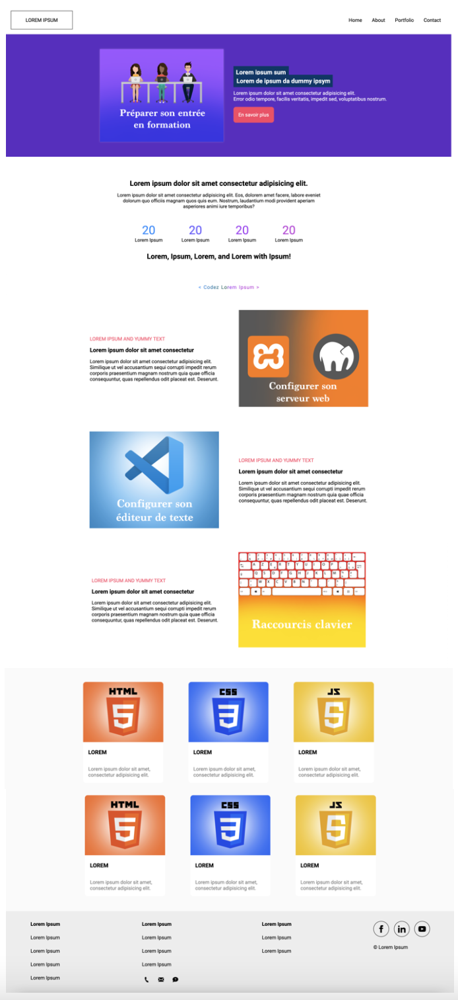

# TP – Intégrer une maquette en HTML5 et CSS3

## 🎯 Objectif

Intégrer une maquette représentant la **première page d’un site web**.  
L’exercice doit être réalisé **sans framework CSS** (type Bootstrap), uniquement avec **HTML5** et **CSS3**.

### Maquette

Voici la maquette qui devra vous servir de base pour votre rendu.

### Demo

Le site Web de démo est consultable ici:

https://ebouchut-laplateforme.github.io/project-html-css-mockup/

Il est déployé automatiquement par *GitHub Pages*, chaque fois qu'on pousse la branche `main` sur GitHub.

---

## Consignes et Recommendations

[La page INSTRUCTIONS.md](INSTRUCTIONS.md) dresse la liste des consignes, contraintes et recommandation à prendre en compte pour réaliser cet exercice.

## Réalisation

Cette section explique les choix de conception, d'agencement (layout) et autres règles CSS et structure HTML utilisées pour obtenir le rendu final.
