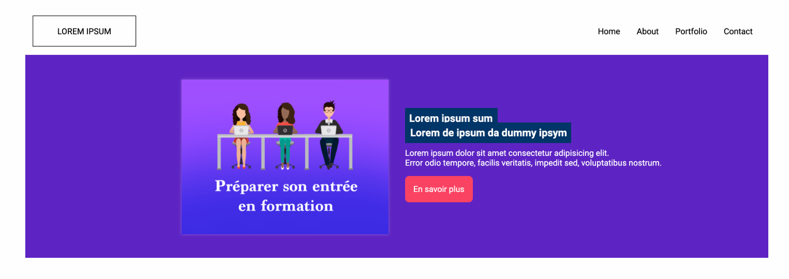
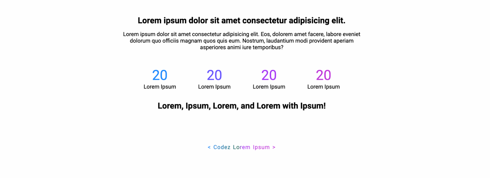
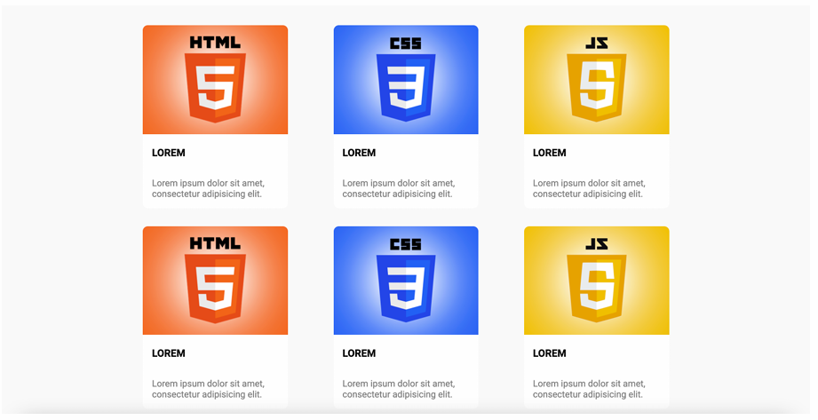
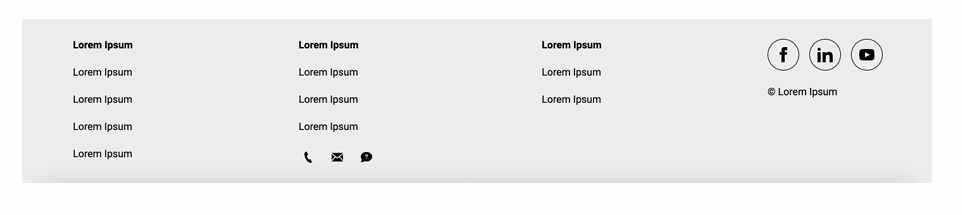

# TP – Intégrer une maquette en HTML5 et CSS3

## 🎯 Objectif

Intégrer une maquette représentant la **première page d’un site web**.  
L’exercice doit être réalisé **sans framework CSS** (type Bootstrap), uniquement avec **HTML5** et **CSS3**.

---

## 🧩 Structure à intégrer

La page doit contenir les sections suivantes :

- `Header`
- `Section 1`
- `Section 2`
- `Section 3`
- `Section 4`
- `Footer`

Les icônes et images nécessaires sont fournies dans les fichiers de ressources associés au TP.

---

## ✅ Contraintes techniques

- 📄 **HTML5/CSS3** uniquement (sans frameworks)
- 💻 Compatible avec : Chrome, Firefox, Edge, Safari, Opera
- 🌐 **Code valide W3C**
- 🗂️ Code bien **indenté** et **commenté**
- 🛑 **Responsive non requis**

---

## 💡 Recommandations

- 📐 Tu peux choisir librement tailles, couleurs, marges…
- 🎨 Utilise une pipette (ex. Photoshop) pour extraire les couleurs de la maquette
- 🧱 Mise en page : utilisation des **flexbox fortement conseillée**
    -   Facilité de layout
    -   Meilleure gestion des espacements
    -   Positionnement plus intuitif

---

## 📝 Bonnes pratiques

- Sépare bien ton CSS (fichier à part recommandé)
- Utilise des classes explicites
- Commente chaque section dans le HTML/CSS
- Nomme ton projet proprement : ex. `site-maquette-html5`

---

## 📦 Arborescence suggérée

```
site-maquette-html5/
├── index.html
├── css/
│ └── style.css
├── assets/
│ ├── images/
│ └── icons/
```

---

## 🧩 Structure

- `Header et Section 1`  
  
- `Section 2`  
  
- `Section 3`  
  
- `Section 4`  
  
- `Footer`  
  
